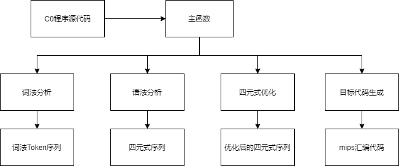
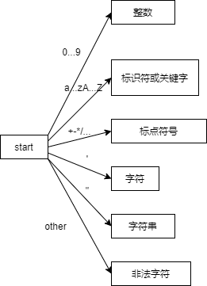

# <center>  2020年编译原理试点班报告

###  <p align="right">zhangyongmao</p>

## 总体情况

* 代码总规模： 2914 (包括注释空行)

* 开发环境： C++   VSCode

* 使用工具情况：未使用任何工具
&nbsp;

* 代码分模块统计 (主要模块)：
	* 词法分析 lexical_anaysis.cpp 		199
	* 语法分析 grammatical_anaylysis.cpp 	1104
	* 四元式优化 midcode_optimization.cpp    652
	* 目标代码生成 code_generator.cpp 	744
	* 顶层调用 compiler.cpp 		69
&nbsp;

* 优化和寄存器分配概况

	* 构建基本块、构建DFG流图

	* 四元式优化 (五种方法)：
		* 局部优化：常量替换、消除公共子表达式、等式替换
		* 全局优化：无用代码删除、代码移动

	* 寄存器分配：
		* FIFO方法，最久未使用过的寄存器首先被替换到内存
&nbsp;

* 模块设计
&nbsp;
<center></center>
			
&nbsp;

* 各个模块调用函数
```c++
	// 词法分析，返回Token序列
	vector<Token> tokens = word_anaylze(file_name);

	// 语法分析，返回四元式序列
	vector<Midcode> midcodes = grammar_anaylze(tokens);

	// 代码优化，返回优化后的四元式序列
	vector<Midcode> optim_midcodes = code_optimize(midcodes);

	// mips汇编生成，生成mips汇编文件
	code_generator(optim_midcodes, "result.asm");
```

## 1、词法分析

* 主要读取要编译的的代码文件，将代码划分为token，token类型有数字、标识符、符号、关键字等。

 ```c++

    enum TYPE{      // token 类型
        DEFAULT,    //初始状态
        END,        //文件结束
        NUM,        //数字
        CHAR,       //字符
        STR,        //字符串
        ID,         //标识符
        PUN,        //标点符号
        KW_CHAR,    //字符类型
        KW_INT,     //int类型
        KW_IF,      //if
        KW_ELSE,    //else
        KW_CONST,   //const
        KW_WHILE,   //while
        KW_VOID,    //void
        KW_RETURN,  //return
        KW_DEF,     //def
        KW_BREAK,   //break
        KW_CONTINUE,//continue
        KW_PRINTF   //printf
    };

    struct Token{
        string word;    //词
        TYPE type;      //类型
        int row;        //行数
    };
 ```

* 计算过程为根据输入字符来分情况生成token

<center></center>
&nbsp;

* 错误处理情况有：非法字符报错、引号不匹配报错等。


## 2、语法分析、语义分析（递归下降）生成中间四元式和符号表

* C0语法:
<center>
<font size=1>

推导式左部|推导式右部
:-:|:-:
＜加法运算符＞ | +｜-
＜乘法运算符＞  | *｜/
＜关系运算符＞  |  <｜<=｜>｜>=｜!=｜==
＜字母＞   | ＿｜a｜．．．｜z｜A｜．．．｜Z
＜数字＞   | ０｜＜非零数字＞
＜非零数字＞  | １｜．．．｜９
＜字符＞    |   '＜加法运算符＞'｜'＜乘法运算符＞'｜'＜字母＞'｜'＜数字＞'
＜字符串＞   |  "｛十进制编码为32,33,35-126的ASCII字符｝"
＜程序＞    | ［＜常量说明＞］［＜变量说明＞］{＜有返回值函数定义＞\|＜无返回值函数定义＞}＜主函数＞
＜常量说明＞ |  const＜常量定义＞;{ const＜常量定义＞;}
＜常量定义＞   |   int＜标识符＞＝＜整数＞{,＜标识符＞＝＜整数＞}\| char＜标识符＞＝＜字符＞{,＜标识符＞＝＜字符＞}
＜无符号整数＞  | ＜非零数字＞｛＜数字＞｝
＜整数＞        | ［＋｜－］＜无符号整数＞｜０
＜标识符＞    |  ＜字母＞｛＜字母＞｜＜数字＞｝
＜声明头部＞   |  int＜标识符＞ \| char＜标识符＞
＜变量说明＞  | ＜变量定义＞;{＜变量定义＞;}
＜变量定义＞  | ＜类型标识符＞(＜标识符＞\|＜标识符＞‘[’＜无符号整数＞‘]’){,(＜标识符＞\|＜标识符＞‘[’＜无符号整数＞‘]’ )}/////不许在定义变量时赋初值.
＜常量＞   |  ＜整数＞\| ＜字符＞
＜类型标识符＞      |  int \| char
＜有返回值函数定义＞  |  ＜声明头部＞‘(’＜参数＞‘)’ ‘{’＜复合语句＞‘}’
＜无返回值函数定义＞  | void＜标识符＞‘(’＜参数＞‘)’‘{’＜复合语句＞‘}’
＜复合语句＞   |  ［＜常量说明＞］［＜变量说明＞］＜语句列＞
＜参数＞    | ＜参数表＞
＜参数表＞    |  ＜类型标识符＞＜标识符＞{,＜类型标识符＞＜标识符＞}\| ＜空＞
＜主函数＞    | void main‘(’‘)’ ‘{’＜复合语句＞‘}’
＜表达式＞    | ［＋｜－］＜项＞{＜加法运算符＞＜项＞}
＜项＞     | ＜因子＞{＜乘法运算符＞＜因子＞}
＜因子＞    | ＜标识符＞｜＜标识符＞‘[’＜表达式＞‘]’｜＜整数＞\|＜字符＞｜＜有返回值函数调用语句＞\|‘(’＜表达式＞‘)’          
＜语句＞    | ＜条件语句＞｜＜循环语句＞\| ‘{’＜语句列＞‘}’｜＜有返回值函数调用语句＞; \|＜无返回值函数调用语句＞;｜＜赋值语句＞;｜＜读语句＞;｜＜写语句＞;｜＜空＞; |＜情况语句＞｜＜返回语句＞;
＜赋值语句＞   |  ＜标识符＞＝＜表达式＞\|＜标识符＞‘[’＜表达式＞‘]’=＜表达式＞
＜条件语句＞  |  if ‘(’＜条件＞‘)’＜语句＞［else＜语句＞］
＜条件＞    |  ＜表达式＞＜关系运算符＞＜表达式＞｜＜表达式＞ //表达式为0条件为假，否则为真
＜循环语句＞   |  while ‘(’＜条件＞‘)’＜语句＞
＜情况语句＞  |  switch ‘(’＜表达式＞‘)’ ‘{’＜情况表＞ ‘}’
＜情况表＞   |  ＜情况子语句＞{＜情况子语句＞}
＜情况子语句＞  |  case＜常量＞：＜语句＞
＜有返回值函数调用语句＞ | ＜标识符＞‘(’＜值参数表＞‘)’
＜无返回值函数调用语句＞ | ＜标识符＞‘(’＜值参数表＞‘)’
＜值参数表＞   | ＜表达式＞{,＜表达式＞}｜＜空＞
＜语句列＞   | ｛＜语句＞｝
＜读语句＞    |  scanf ‘(’＜标识符＞{,＜标识符＞}‘)’
＜写语句＞    | printf ‘(’ ＜字符串＞,＜表达式＞ ‘)’\| printf ‘(’＜字符串＞ ‘)’\| printf ‘(’＜表达式＞‘)’
＜返回语句＞   |  return[‘(’＜表达式＞‘)’]  

</font>
</center> 
&nbsp;

* 额外实现的语法：
	* for 循环语法
	* 布尔表达式  支持与或非操作： && || ! ,不支持加括号 
&nbsp;

* 实现思路举例
	* if-else 语法实现
	```c++
	void if_statement(){
		if(match_s("if", true)){
			assert_s("(");
			next_Token();
			string tmp_label1 = bool_statement();
			assert_s(")");
			next_Token();
			Statement();
			
			if(match_s("else", true)){
				string tmp_label2 = next_label();
				new_midcode("jmp", "", "", tmp_label2);
				new_midcode("label", "", "", tmp_label1);
				Statement();
				new_midcode("label", "", "", tmp_label2);
			}
			else{
				new_midcode("label", "", "", tmp_label1);
			}
		}
	}
	```
	如果条件bool statement为True，则顺序执行if的statement部分，如果没有else则直接向下进行，如果有else，则通过jmp到label2来跳过else部分语句。
	
	如果条件为False，此时如果有else则跳转到label1执行else的statement，如果没有else，则会跳转到label1，继续向下执行。（这里的两个label1根据else的有无来设立的，有无的情况下位置不同）
&nbsp;

* 语言文法覆盖情况

	所有的C0语法都经过测试，变量定义、变量赋值、if、while等控制结构、函数调用等。常用的语法经过多个测试程序的测试，易错点专门测试，如switch语句、递归调用函数、布尔表达式等。测试程序在test_file文件中。

	由于测试结果太长，部分测试结果放在了附录中
&nbsp;

* 四元式设计：

```c++
struct Midcode{     //四元式
    std::string op;
    std::string s1;
    std::string s2;
    std::string s3;
};
```
<center>
<font size=2>

语义   |  代码举例  |  四元式定义 
:-----:| :-------: | :--------: 
int常量定义 | const int a = 0; | \<const_int, 0, , a\>
char常量定义 | const char a = 's'; | \<const_char, s, ,a\>
int变量定义| int a; | \<int, , , a\>
char变量定义| char a; | \<char, , a \>
int数组定义|int a[10];| \<int_array, 10, , a \>
char数组定义|char a[10];| \<char_array, 10, , a\>
加法运算| a + b| \<+, a, b, var\> 
减法运算| a - b| \<-, a, b, var\>
乘法运算| a * b| \<*, a, b, var\>
除法运算| a / b| \</, a, b, var\>
负号运算| - a  | \<-, 0, a, var\>
赋值    | a = b| \<=, b, , a\>
布尔运算相等跳转| a == b| \<==, a, b, label\>
布尔运算不等跳转| a != b| \<!=, a, b, label\>
布尔运算小于跳转| a < b | \< <, a, b, label\>
布尔运算大于跳转| a > b | \< >, a, b, label\>
布尔运算小于等于跳转|a <= b| \< <=, a, b, label\>
布尔运算大于等于跳转|a >= b| \< >=, a, b, label\>
数组取数操作| a[1] | \<[], a, 1, var\>
数组赋值操作| a[1] = b | \<[]=, b, 1, a\>
输入| scanf(a) | \<scanf, , int, a\>
输出| printf("s",a)| \<printf, s, a, int\>
无条件跳转| jump to label | \<jmp, , ,label\>
跳转点| label: | \<label, , , label\>
函数定义| void\int\char func()| \<func, void\int\char, , func\>
函数参数| func(int\char a) | \<param, int\char , , a\>
调用函数| func() | \<call, func, , , \>
调用函数| a = func() | \<call_r , func, , a\>
调用传递参数| func(a) | \<call_param , , ,a\>
函数返回| return a | \<return , , ,a \>
函数结束| }        | \<end_func , , ,\>
程序退出| main() return | \<exit , , , \>

</font>
</center>
&nbsp;

* 递归下降过程：
&nbsp;
	* 递归下降思想为为每一个非终结符编写一个函数来处理，这些函数间存在递归调用的关系，如if语句中调用了布尔表达式函数和复杂语句函数，复杂语句函数又会根据if内部内容来调用相应的赋值语句、if语句、while语句等等。
	```c++
	if(布尔表达式){
		复杂语句
	}
	```


	* 我们在这部分的任务主要是实现所有非终结符的递归函数，将token序列转化为四元式序列。


	* 其他：
		* 大部分非终结符对应四元式的生成只需要看当前token来判断进行的下一步，即顺序处理顺序生成四元式即可，但一些非终结符需要特殊处理，如switch语句的跳转需要先向前看n个token来确定有几个case。
&nbsp;

* 符号表设计:

``` c++
struct Symbol{
    std::string name;    //变量名
    std::string type;    //类型
    int value;      //值
    int size;       //大小(变量为0，数组为数组大小)
};

struct Func{
    std::string name;    //函数名
    int param_num;       //参数数量
    int param_bytesize;  //参数字节大小
    bool is_return;      //是否有返回值
};

class Symbol_Table{
    public:
        int Num_var;
        std::map<std::string, Func> map_func;
        std::map<std::string, int> index_var; // const、global、func_name   + ":" + var_name
        std::vector<Symbol> All_var;
};
```


* 错误处理：
	* 根据维护的符号表和一些非终结符给定的格式来判断语法语义错误，如表达式括号不匹配、使用未定义变量等。

    * 定义输出错误信息函数，每个递归下降函数对自己处理的片段进行错误处理，输出出错的token字符和行数。如括号不匹配，缺少等号等。由于使用了该函数来处理错误，所以错误处理变得比较简便。

    * 一些不能用该错误信息函数处理的特殊错误，如使用未出现的变量等，会在相应的函数进行特殊处理输出错误信息。


* 注意事项：
    * C0文法基本不需改动即可用递归下降实现，但是一些语法需要向前观看n个token来翻译，如switch语句、函数声明和变量声明的区分。这些语句需要特殊处理。

    * 符号表记录了每个变量的信息和每个函数的信息，用来进行语义检查，判断语句是否合法，如a[0]中a是否为数组，但符号表的组织形式应该尽可能简洁高效，否则进行记录和查询的时候会比较麻烦，同时要方便地查出符号及其对应的作用域。(本代码符号表用vector记录，用map索引)


## 3、代码优化

* 优化思路：基本思路为根据DFG流图来优化，有基本块内的局部优化和全局优化，需要进行的预处理为划分基本块，并将基本块链接为DFG图，本代码实现的优化方法有：常量合并、消除公共子表达式、等式替换、无用代码消除、代码移动，共五种方法。
&nbsp;
	* 首先对生成的四元式序列进行分块，分为基本块，即每个基本块内部会顺序执行，不会跳转到其他位置。方法也很简单，只要划分所有跳转指令和label指令即可，每个跳转指令后的第一条指令为基本块首指令、每个label指令为基本块首指令。
&nbsp;

	* 构建DFG流图来作为优化的基础，DFG流图的每一个节点是一个基本块，当基本块a之后可能跳转到基本块b执行时，DFG流图中节点a会有一条由a点到b点的有向边。构建方法参考哈工大慕课，根据上一步划分的基本块进行。
&nbsp;

	* 活跃变量分析：每个基本块构建一个首部活跃变量集合一个尾部活跃变量集合，根据所有基本块的两个集合及基本块之间的跳转关系来进行迭代，更新每个基本块的两个集合中的值，直到所有集合的值不再变化时，分析结束，最终每个首部集合的变量即该基本块开始处的活跃变量，尾部集合中的变量即该基本块尾部处的活跃变量。在进行全局代码优化的过程中需要用到哪些变量是活跃的哪些不是活跃的，据此进行无用代码删除。
&nbsp;

	* 根据已有的DFG流图和活跃变量进行优化。优化方法分为局部优化和全局优化，局部优化为基本块内部的优化，全局优化为根据所有基本块一起优化。
&nbsp;

* 采用的优化技术：
	* 本代码实现的优化方法有：常量合并、消除公共子表达式、等式替换、无用代码消除、代码移动，共五种方法。
&nbsp;
	* 局部优化：常量合并、消除公共子表达式、等式替换
&nbsp;
		* 常量合并
			* 将源操作数都为为常数的或者为已经定义过的常变量的计算四元式替换为赋值四元式
			```c++
			add,1,2,n
			```
			```c++
			=,3, ,n
			```
			* 将n = 1 + 2 转化为了 n = 3
&nbsp;

		* 消除公共子表达式
			* 在基本块内部扫描，每条四元式都向下寻找源操作数未被重新赋值且与自己源操作数相同的四元式，找到后进行替换，将新的计算四元式改为赋值四元式，消除公共子表达式。
			```c++
			n = a + b;
			p = a + 3;
			m = a + b;
			```
			```c++
			n = a + b;
			p = a + 3;
			m = n;
			```
			* 将m的计算改为将已经计算过的n的赋值，减少了计算，产生的赋值语句可以在后面的步骤中进一步优化
&nbsp;

		* 等式替换
			* 对于每一个等式(原本有的和上两步优化产生的)，将等式后面使用到等式左变量的位置换为等式右变量，减少右变量的使用，使本赋值语句变得无用并在无用代码生成中被删掉，减少一条赋值语句。
			```c++
			a = b;
			c = a + 1;
			d = a + c;
			```
			```c++
			a = b;
			c = b + 1;
			d = b + c;
			```
			* 将等式后面对a的使用改为对b的使用，可以在局部产生无用赋值语句a = b，为下一步无用代码删除创造条件
&nbsp;

	* 全局优化：无用代码消除、代码移动
&nbsp;

		* 无用代码删除
			
			* 全局优化比较麻烦，需要考虑所有基本块之间的跳转关系，思路为先根据构建的DFG图来计算每个基本块首部和尾部的活跃变量(根据每个基本块内def集和use集来迭代计算)，之后根据每个基本块的尾部活跃变量来判断基本块内语句是否有用，删掉无用的语句
			```c++
			m = a + b;
			n = c + a;
			p = b + n;
			return n;
			```
			```c++
			n = c + a;
			return n;
			```
			* return 语句为基本块结尾，最后只需要n的值，所以m和p的计算为无用的，删掉无用代码
&nbsp;

		* 代码移动

			* 代码移动用于将循环语句中的一些与循环无关的代码移动到循环开始前，减少循环中的计算量。
			```c++
			while(i < 10){
				a = c + 1;
				printf(a);
				i = i + 1;
			}
			```
			```c++
			a = c + 1;
			while(i < 10){
				printf(a);
				i = i + 1;
			}
			```

			* 在循环进行中a的值不会改变，所以在循环开始前对a赋值，循环中不再计算a，可以减少循环计算量。而循环又是代码计算量集中的地方，所以这种优化较为有用。
&nbsp;

	* 前五种优化方法依次按顺序进行，前面生成的语句可以在后面进一步优化，环环相扣，尽可能最大地减少无用指令。
		


## 4、代码生成 code_generator.cpp

* 将生成的四元式翻译成mips汇编代码
&nbsp;

* mips汇编程序说明：
    * MIPS 包含32个通用寄存器 （$0-$31均为32 位），其中本代码使用到的简要说明：
        * $sp,$fp:堆栈指针，用来使用堆栈，堆栈向低地址增长
        * $t0-9:临时寄存器
        * $ra:存放返回地址
        * $a0-4:参数寄存器
        * $v0-1:返回值寄存器
    * MIPS指令包括R、I、J三种格式的指令，指令集共有31条标准指令，但mips汇编为了方便用户编程，定义了一些宏指令和伪指令，汇编器执行汇编程序时自动将这些指令转化为标准指令执行。
&nbsp;

* 四元式翻译为mips汇编指令过程
    * 将生成的四元式序列逐条翻译即可，此处难点就是寄存器的分配和堆栈的使用，如何高效使用寄存器，如何在内存中存放临时变量、全局变量等。
&nbsp;

* 寄存器调度优化：
    * 大多数mips寄存器都有一系列的使用约定，直接按照通常使用约定来使用即可，但是有些寄存器的调度却可以自己定义，比如$t0-9，这些寄存器用来存放临时变量等，如何高效使用这些寄存器是一个难点。
&nbsp;
    * 初始考虑使用的方法是：对于局部变量和计算过程生成的临时变量都在栈中开辟空间存放，在+-*/计算时使用两个$t临时寄存器来存放，计算完后将结果存放如另一个$t寄存器中，然后写回栈中。
&nbsp;
    * 优化方法：对于一个计算操作，可以分为三步：加载(lw),计算(add),写回(sw)，其中计算部分不可省略，可以进行优化的部分只有加载和写回，于是，优化策略即尽可能地使用寄存器来存放变量，这样不需要每次重新从栈中读取和写回，可以节省两条指令，但是寄存器有限，必须要将一些变量存放回栈，于是我采取的策略：如果当前临时寄存器中已经存放了某个变量的值，则计算时直接使用对应寄存器，不再进行读取，计算完后结果先不写回，当该寄存器需要被存放其他变量或进行函数调用时，才将寄存器中的值写回栈中。
&nbsp;
    * 实现方法：本代码维护一个记录每个寄存器当前存放的变量的表，每次要使用某个变量时先查看一下是否有寄存器已经存放了该变量的当前值，如果有直接使用，如果没有，则使用FIFO策略，尽可能多地使用所有$t寄存器，使变量有更大的机会被存放在寄存器里，充分利用寄存器资源。相应的，每次某个变量或寄存器被改动或使用时，更新寄存器-变量表，保证分配结果正确。而在某个变量的值计算出来之后，不立刻将寄存器中的值存放到内存中，直到该寄存器需要被分配存放别的值或者调用函数时才会将寄存器中放不下的值写回内存。
&nbsp;

* 代码结构重构：代码结构为针对每一四元式类型编写一个函数完成向mips汇编的转化。完成一部分相应函数后发现很多个函数的内容基本一样，比如+-*/运算转化为汇编的函数只有最后的符号不同，其他有关寄存器等的操作完全一样，可以合并为一个单独的函数。于是进行重构，把相同的寄存器选取等部分写为单独函数，代码量大大减少了，并且修改寄存器操作时只要修改合并的函数即可，更加方便。
&nbsp;

* 代码生成实例：
	* 生成一条add四元式对应的mips汇编(加减乘除基本一样，只是改了汇编的操作类型)
	* 生成时，当前四元式current_midcode是 <add,a,b,tmp_1> 时，调用gen_add函数，生成对应mips汇编
	* gen_add 函数调用get_reg3函数得到变量a、b、tmp_1的寄存器（假设分别是$t1, $t2, $t3），然后生成add $t3 $t1 $t2这条汇编。
	* gen_reg3 函数会自动获得变量a、b和计算结果tmp_1三者对应的寄存器，此处使用寄存器分配策略FIFO，如果变量存放在栈中，先为变量分配寄存器，然后读取进来，如果寄存器中已经有了该变量，则直接返回该寄存器即可。
	* 最后调用add_tmp_var函数记录生成的临时变量

	```c++
	vector<string> get_reg3(){
		string reg_1, reg_2, reg_3;
		reg_1 = get_var_reg(current_midcode.s1);
		if(reg_1 == ""){
			if(is_number(current_midcode.s1)){
				reg_1 = get_reg("");
				cout<<"\t\tli\t"<<reg_1<<"\t"<<current_midcode.s1<<endl;
			}
			else if(get_localvar_offset(current_midcode.s1) != ""){
				reg_1 = get_reg(current_midcode.s1);
				string offset = get_localvar_offset(current_midcode.s1);
				cout<<"\t\tlw\t"<<reg_1<<"\t"<<offset<<"($fp)"<<endl;
			}
			else{
				reg_1 = get_reg(current_midcode.s1);
				cout<<"\t\tla\t$t0\t"<<current_midcode.s1<<endl;
				cout<<"\t\tlw\t"<<reg_1<<"\t($t0)"<<endl;
			}
		}
		
		reg_2 = get_var_reg(current_midcode.s2);
		if(reg_2 == ""){
			if(is_number(current_midcode.s2)){
				reg_2 = get_reg("");
				cout<<"\t\tli\t"<<reg_2<<"\t"<<current_midcode.s2<<endl;
			}
			else if(get_localvar_offset(current_midcode.s2) != ""){
				reg_2 = get_reg(current_midcode.s2);
				string offset = get_localvar_offset(current_midcode.s2);
				cout<<"\t\tlw\t"<<reg_2<<"\t"<<offset<<"($fp)"<<endl;
			}
			else{
				reg_2 = get_reg(current_midcode.s2);
				cout<<"\t\tla\t$t0\t"<<current_midcode.s2<<endl;
				cout<<"\t\tlw\t"<<reg_2<<"\t($t0)"<<endl;
			}
		}

		if(is_tmp_var(current_midcode.s3) && get_localvar_offset(current_midcode.s3) == ""){
			push_local_var(current_midcode.s3, 4);
		}
		if(get_var_reg(current_midcode.s3) != ""){
			reg_3 = get_var_reg(current_midcode.s3);
		}
		else{
			reg_3 = get_reg(current_midcode.s3);
		}

		vector<string> result;
		result.push_back(reg_1);
		result.push_back(reg_2);
		result.push_back(reg_3);
		return result;
	}

	void add_tmp_var(string tmp_var){
		if(is_tmp_var(tmp_var) && get_localvar_offset(tmp_var) == ""){
			push_local_var(tmp_var, 4);
		}
	}

	void gen_add(){
		vector<string> tmp_reg = get_reg3();
		cout<<"\t\tadd\t"<<tmp_reg[2]<<"\t"<<tmp_reg[0]<<"\t"<<tmp_reg[1]<<endl;
		add_tmp_var(current_midcode.s3);
	}
	```

* 生成结果测试：
	* c0语法代码
	```c++
	int t(int k) {  
		if (k==0)   
		return (1);  
		if (k==1)    
		return (1);      
		return (t(k-1)+t(k-2));
	}   
	void main(){  
		int n,result;     
		printf("Please enter n: ");  
		scanf(n);     
		result=t(n);  
		printf("t(n) is: ");  
		printf(result);      
		return;
	}
	```

	* mips汇编
	```mips
	.data
	string0:	.asciiz	"Please enter n: "
	string1:	.asciiz	"t(n) is: "
	string2:	.asciiz	""
	.text
	.global main
			j	main
	t:
			lw	$a0	4($fp)
			subi	$sp	$sp	4
			sw	$a0	-8($fp)
			lw	$t1	-8($fp)
			li	$t2	0
			bne	$t1	$t2	LABEL_0
			li	$t3	1
			move	$v1	$t3
			move	$sp	$fp
			lw	$fp	($sp)
			move	$t0	$ra
			lw	$ra	-4($sp)
			jr	$t0
	LABEL_0:
			li	$t4	1
			bne	$t1	$t4	LABEL_1
			li	$t5	1
			move	$v1	$t5
			move	$sp	$fp
			lw	$fp	($sp)
			move	$t0	$ra
			lw	$ra	-4($sp)
			jr	$t0
	LABEL_1:
			li	$t6	1
			subi	$sp	$sp	4
			sub	$t7	$t1	$t6
			subi	$sp	$sp	4
			sw	$t7	-16($fp)
			sw	$t1	-8($fp)
			sw	$t7	-12($fp)
			sw	$fp	($sp)
			move	$fp	$sp
			subi	$sp	$sp	4
			sw	$ra	($sp)
			subi	$sp	$sp	4
			jal	t
			addi	$sp	$sp	4
			subi	$sp	$sp	4
			sw	$v1	-16($fp)
			lw	$t1	-8($fp)
			li	$t2	2
			subi	$sp	$sp	4
			sub	$t3	$t1	$t2
			subi	$sp	$sp	4
			sw	$t3	-24($fp)
			sw	$t1	-8($fp)
			sw	$t3	-20($fp)
			sw	$fp	($sp)
			move	$fp	$sp
			subi	$sp	$sp	4
			sw	$ra	($sp)
			subi	$sp	$sp	4
			jal	t
			addi	$sp	$sp	4
			subi	$sp	$sp	4
			sw	$v1	-24($fp)
			lw	$t1	-16($fp)
			lw	$t2	-24($fp)
			subi	$sp	$sp	4
			add	$t3	$t1	$t2
			move	$v1	$t3
			move	$sp	$fp
			lw	$fp	($sp)
			move	$t0	$ra
			lw	$ra	-4($sp)
			jr	$t0
	main:
			subi	$sp	$sp	4
			move	$fp	$sp
			subi	$sp	$sp	8
			subi	$sp	$sp	4
			subi	$sp	$sp	4
			la	$t0	string0
			move	$a0	$t0
			li	$v0	4
			syscall
			li	$v0	5
			syscall
			sw	$v0	-8($fp)
			subi	$sp	$sp	4
			lw	$t1	-8($fp)
			sw	$t1	-16($fp)
			sw	$t1	-8($fp)
			sw	$fp	($sp)
			move	$fp	$sp
			subi	$sp	$sp	4
			sw	$ra	($sp)
			subi	$sp	$sp	4
			jal	t
			addi	$sp	$sp	4
			subi	$sp	$sp	4
			sw	$v1	-16($fp)
			la	$t0	string1
			move	$a0	$t0
			li	$v0	4
			syscall
			la	$t0	string2
			move	$a0	$t0
			li	$v0	4
			syscall
			lw	$a0	-16($fp)
			li	$v0	1
			syscall
			li	$v0	10
			syscall
	```

## 设计特色
* 整体结构简洁清晰，可以最大程度减少调试时的压力、
	* 各个模块功能分明，结构简明易懂
	* 语法分析部分所有生成式函数按照顺序编写，方便查找、调试
	* 目标代码生成部分每类四元式对应一个函数，全部按照顺序编写，结构清晰
	```c++
	// 非终结符函数声明
	int number();
	void Factor();
	void Term();
	void Expression();
	void const_def();
	void const_describe();
	void variable_describe();
	void if_statement();
	void while_statement();
	void scanf_statement();
	void printf_statement();
	void return_statement();
	void assign_statement();
	void Statement();
	void Statement_list();
	bool is_func_def();
	void Parameter();
	void void_func_def();
	void return_func_def();
	void func_def();
	void call_func();
	void call_func_void();
	string call_func_return();
	string condition();
	```

* 使用出错处理函数，方便进行错误判断和提示
	* 语法分析部分编写 assert\assert_t\assert_s 三个出错处理函数辅助进行出错处理，编写 match\match_s\match_t 三个判断函数辅助进行错误判断，可以大大减少了每个出错处理需要的代码量，每个错误只需要一个函数调用即可判断并自动输出错误信息及出错位置，便于尽可能详尽地进行更加完善的错误处理。

	```c++
	// 断言 用来处理错误
	void assert(TYPE type, string s){
		if(current_token.type != type || current_token.word != s){
			cout<<"Error  assert error : word = "<<current_token.word<<" want word = "<<s<<" row = "<<current_token.row<<endl;
		}
	}
	void assert_t(TYPE type){
		if(current_token.type != type){
			cout<<"Error  assert_t error : word = "<<current_token.word<<" want type = "<<type<<" row = "<<current_token.row<<endl;
		}
	}
	void assert_s(string s){
		if(current_token.word != s){
			cout<<"Error  assert_s error : word = "<<current_token.word<<" want word = "<<s<<" row = "<<current_token.row<<endl;
		}
	}
	```

* 将各个阶段的结构输出到文件，最终结果出错时可以逐步向上查找错误，方便调试。

* 使用C++ STL库的vector、map等来记录符号表、寄存器使用情况等，方便高效。
例如使用vector存储加map索引结构存储符号表，减少内存碎片的同时提高查找速度。
	```c++
	class Symbol_Table{
		public:
			int Num_var;
			std::map<std::string, Func> map_func;
			std::map<std::string, int> index_var; // const、global、func_name   + ":" + var_name
			std::vector<Symbol> All_var;
	};
	```

* 代码经过重构，将频繁使用的代码封装成函数，实现高内聚低耦合，各个模块间结构简明，模块内部代码尽可能复用，同等功能下代码量大大减少（代码生成部分使用get_reg函数）


## 遇到个各种问题及建议
* 代码长了以后调试起来就很头疼，有时候一些很小的错误不易发现，我的策略是将每一步生成的结果都保存为文件，四元式文件、优化后四元式文件、汇编结果文件，最后结果有错时可以一段一段判断，缩小范围。
&nbsp;

* 错误处理部分比较麻烦，因为错误类型太多，如果每个都用if来进行太麻烦，可以定义一个通用的报错函数或部分来处理，另外我是边写递归下降边写错误处理，感觉一起写思路会清晰一点
&nbsp;

* 代码生成部分应该是最难写的了，四元式还比较直观，到了汇编就不能一眼看懂了，有时汇编运行起来是错的，但看不出错出在哪块，只能看着汇编器的仿真结果来一点一点查，通常需要很久才能发现哪里错了。
&nbsp;

* 有些c++语言相关的问题也困扰了我很久，比如头文件的编写、环境的配置等，头文件中应该包括该编译单元对外提供的方法的声明以及类和结构体的声明，vscode使用自己安装的MinGW来编译c++，需要配置相关环境，另外用vscode编译c++时，需要自己在 tasks.json 配置文件里添加另外需要编译的编译单元

## 实验总结
* 这次编译原理试点班实验工作量很大，需要自学很多东西，编写很多代码，但收获也很多。我觉得最大的收获是对编译器的运行原理有了更深的了解，了解其各个部分进行的工作，因此对各种程序语言的理解也有帮助，之前只感觉编译过程很神秘，像一个未知的黑盒，也不知道编译器背后做了这么多的优化。
&nbsp;

* 整个过程中虽然遇到了很多问题，但还是很有趣的，可以说是本学期最有趣的一门课了。


## 附录-测试结果

* 测试样例1
	* 源程序
	```c++
	int change[10];
	void main(){
		int a,b,c,d;
		a = 1;
		b = 2;
		c = 4;
		d = 100;
		if(a == 1 && b == 2 && c == 5 || d != 99 && d == 101 || c == 4 && d != 0){
			printf("vvvvvv");
		}
		else{
			printf("fffffff");
		}
		return (0);
	}
	```
	* 四元式
	```
	int_array,10, ,change
	func, , ,main
	int, , ,a
	int, , ,b
	int, , ,c
	int, , ,d
	=,1, ,a
	=,2, ,b
	=,4, ,c
	=,100, ,d
	==,a,1,LABEL_3
	jmp, , ,LABEL_2
	label, , ,LABEL_3
	==,b,2,LABEL_4
	jmp, , ,LABEL_2
	label, , ,LABEL_4
	==,c,5,LABEL_5
	jmp, , ,LABEL_2
	label, , ,LABEL_5
	jmp, , ,LABEL_0
	label, , ,LABEL_2
	!=,d,99,LABEL_7
	jmp, , ,LABEL_6
	label, , ,LABEL_7
	==,d,101,LABEL_8
	jmp, , ,LABEL_6
	label, , ,LABEL_8
	jmp, , ,LABEL_0
	label, , ,LABEL_6
	==,c,4,LABEL_10
	jmp, , ,LABEL_9
	label, , ,LABEL_10
	!=,d,0,LABEL_11
	jmp, , ,LABEL_9
	label, , ,LABEL_11
	jmp, , ,LABEL_0
	label, , ,LABEL_9
	jmp, , ,LABEL_1
	label, , ,LABEL_0
	printf,vvvvvv, , 
	jmp, , ,LABEL_12
	label, , ,LABEL_1
	printf,fffffff, , 
	label, , ,LABEL_12
	exit, , , 
	```

	* mips汇编
	```mips
	.data
	change:	.space	40
	string0:	.asciiz	"vvvvvv"
	string1:	.asciiz	"fffffff"
	.text
	.global main
			j	main
	main:
			subi	$sp	$sp	4
			move	$fp	$sp
			subi	$sp	$sp	8
			subi	$sp	$sp	4
			subi	$sp	$sp	4
			subi	$sp	$sp	4
			subi	$sp	$sp	4
			li	$t1	2
			sw	$t1	-12($fp)
			li	$t2	4
			sw	$t2	-16($fp)
			li	$t3	100
			sw	$t3	-20($fp)
			li	$t4	1
			li	$t5	1
			beq	$t4	$t5	LABEL_3
			j	LABEL_2
	LABEL_3:
			lw	$t6	-12($fp)
			li	$t7	2
			beq	$t6	$t7	LABEL_4
			j	LABEL_2
	LABEL_4:
			lw	$t8	-16($fp)
			li	$t9	5
			beq	$t8	$t9	LABEL_5
			j	LABEL_2
	LABEL_5:
			j	LABEL_0
	LABEL_2:
			lw	$t1	-20($fp)
			li	$t2	99
			bne	$t1	$t2	LABEL_7
			j	LABEL_6
	LABEL_7:
			li	$t3	101
			beq	$t1	$t3	LABEL_8
			j	LABEL_6
	LABEL_8:
			j	LABEL_0
	LABEL_6:
			li	$t4	4
			beq	$t8	$t4	LABEL_10
			j	LABEL_9
	LABEL_10:
			li	$t5	0
			bne	$t1	$t5	LABEL_11
			j	LABEL_9
	LABEL_11:
			j	LABEL_0
	LABEL_9:
			j	LABEL_1
	LABEL_0:
			la	$t0	string0
			move	$a0	$t0
			li	$v0	4
			syscall
			j	LABEL_12
	LABEL_1:
			la	$t0	string1
			move	$a0	$t0
			li	$v0	4
			syscall
	LABEL_12:
			li	$v0	10
			syscall

	```

* 测试样例2
	* 源程序
	```c++
	int change[10];
	void main(){
		change[0+1]=1;
		change[1+2]=2;
		change[2+3]=change[1+0]+change[1+1+1];
		if(change[1]<change[1+2])
		printf(change[5]);
		else 
		printf("false",change[5]);
	}
	```
	* 四元式
	```
	int_array,10, ,change
	func, , ,main
	+,0,1,$tmp0
	[]=,1,$tmp0,change
	+,1,2,$tmp1
	[]=,2,$tmp1,change
	+,2,3,$tmp2
	+,1,0,$tmp3
	[],change,$tmp3,$tmp4
	+,1,1,$tmp5
	+,1,$tmp5,$tmp6
	[],change,$tmp6,$tmp7
	+,$tmp4,$tmp7,$tmp8
	[]=,$tmp8,$tmp2,change
	[],change,1,$tmp9
	+,1,2,$tmp10
	[],change,$tmp10,$tmp11
	<,$tmp9,$tmp11,LABEL_3
	jmp, , ,LABEL_2
	label, , ,LABEL_3
	jmp, , ,LABEL_0
	label, , ,LABEL_2
	jmp, , ,LABEL_1
	label, , ,LABEL_0
	[],change,5,$tmp12
	printf, ,$tmp12,int
	jmp, , ,LABEL_4
	label, , ,LABEL_1
	[],change,5,$tmp13
	printf,false,$tmp13,int
	label, , ,LABEL_4
	exit, , , 
	```

	* 优化后的四元式
	```
	int_array,10, ,change
	func, , ,main
	nop,1, ,$tmp0
	[]=,1,1,change
	nop,3, ,$tmp1
	[]=,2,3,change
	nop,5, ,$tmp2
	nop,1, ,$tmp3
	[],change,1,$tmp4
	nop,2, ,$tmp5
	nop,3, ,$tmp6
	[],change,3,$tmp7
	+,$tmp4,$tmp7,$tmp8
	[]=,$tmp8,5,change
	[],change,1,$tmp9
	nop,3, ,$tmp10
	[],change,3,$tmp11
	<,$tmp9,$tmp11,LABEL_3
	jmp, , ,LABEL_2
	label, , ,LABEL_3
	jmp, , ,LABEL_0
	label, , ,LABEL_2
	jmp, , ,LABEL_1
	label, , ,LABEL_0
	[],change,5,$tmp12
	printf, ,$tmp12,int
	jmp, , ,LABEL_4
	label, , ,LABEL_1
	[],change,5,$tmp13
	printf,false,$tmp13,int
	label, , ,LABEL_4
	exit, , , 
	```
	* mips汇编
	```mips
	.data
	change:	.space	40
	string0:	.asciiz	""
	string1:	.asciiz	"false"
	.text
	.global main
			j	main
	main:
			subi	$sp	$sp	4
			move	$fp	$sp
			subi	$sp	$sp	8
			li	$t1	1
			li	$t2	4
			la	$t0	change
			add	$t0	$t0	$t2
			sw	$t1	($t0)
			li	$t4	2
			li	$t5	12
			la	$t0	change
			add	$t0	$t0	$t5
			sw	$t4	($t0)
			li	$t7	4
			la	$t0	change
			add	$t0	$t0	$t7
			lw	$t8	($t0)
			subi	$sp	$sp	4
			sw	$t8	-8($fp)
			li	$t9	12
			la	$t0	change
			add	$t0	$t0	$t9
			lw	$t1	($t0)
			subi	$sp	$sp	4
			sw	$t1	-12($fp)
			lw	$t2	-8($fp)
			lw	$t3	-12($fp)
			subi	$sp	$sp	4
			add	$t4	$t2	$t3
			li	$t5	20
			la	$t0	change
			add	$t0	$t0	$t5
			sw	$t4	($t0)
			li	$t7	4
			la	$t0	change
			add	$t0	$t0	$t7
			lw	$t8	($t0)
			subi	$sp	$sp	4
			sw	$t8	-20($fp)
			li	$t9	12
			la	$t0	change
			add	$t0	$t0	$t9
			lw	$t1	($t0)
			subi	$sp	$sp	4
			sw	$t1	-24($fp)
			sw	$t2	-8($fp)
			lw	$t2	-20($fp)
			sw	$t3	-12($fp)
			lw	$t3	-24($fp)
			blt	$t2	$t3	LABEL_3
			j	LABEL_2
	LABEL_3:
			j	LABEL_0
	LABEL_2:
			j	LABEL_1
	LABEL_0:
			sw	$t4	-16($fp)
			li	$t4	20
			la	$t0	change
			add	$t0	$t0	$t4
			lw	$t5	($t0)
			subi	$sp	$sp	4
			sw	$t5	-28($fp)
			la	$t0	string0
			move	$a0	$t0
			li	$v0	4
			syscall
			lw	$a0	-28($fp)
			li	$v0	1
			syscall
			j	LABEL_4
	LABEL_1:
			li	$t6	20
			la	$t0	change
			add	$t0	$t0	$t6
			lw	$t7	($t0)
			subi	$sp	$sp	4
			sw	$t7	-32($fp)
			la	$t0	string1
			move	$a0	$t0
			li	$v0	4
			syscall
			lw	$a0	-32($fp)
			li	$v0	1
			syscall
	LABEL_4:
			li	$v0	10
			syscall
	```

* 测试样例1
	* 源程序
	```c++
	const int const1 =1,const2= -100;
	const int const3 = 100;
	const char const4 = '+';

	int var1,var2;
	int var3;
	int var4;

	int max(int var1,int var2,int var3){
		int dell;
	if(var1>=var2)
	{
		if(var1>=var3)
		dell=var1;
		else dell =var3;
		}
		else
		{
		if(var2>=var3)
		dell =var2;
		else dell = var3;
		}
		return(dell);
	}
	int add1(int base,int step,int n){
	while(n>0){
		base = base +step;
		n=n-1;
		}
		return(base);
	}

	void main(){
		int cast1,cast2,cast3;
		int cast4,cast5,cast6;
		int rel,choice;

		var3=const3;
		var4=const4;

		printf("input there number");
		scanf(cast1,cast2,cast3);
		var1 = max(cast1,cast2,cast3);
		printf("the max number:",var1);

		printf("Input the base:");
		scanf(cast4);
		printf("Input the step:");
		scanf(cast5);
		printf("Input the number:");
		scanf(cast6);
		rel = add1(cast4,cast5,cast6);

		printf("the result:");
		printf(rel);
		printf(var4);

		printf("Input the choice: 1 2 3 , 0 for return ");
		scanf(choice);
		while(choice != 0)
		{
			switch(choice){
				case 1:printf("good");
				case 2:printf("better");
				case 3:printf("best");
			}
			scanf(choice);
		}
	}
	```

	* 四元式
	```
	const_int,1, ,const1
	const_int,-100, ,const2
	const_int,100, ,const3
	const_char,43, ,const4
	int, , ,var1
	int, , ,var2
	int, , ,var3
	int, , ,var4
	func,int, ,max
	param,int, ,var1
	param,int, ,var2
	param,int, ,var3
	int, , ,dell
	>=,var1,var2,LABEL_3
	jmp, , ,LABEL_2
	label, , ,LABEL_3
	jmp, , ,LABEL_0
	label, , ,LABEL_2
	jmp, , ,LABEL_1
	label, , ,LABEL_0
	>=,var1,var3,LABEL_7
	jmp, , ,LABEL_6
	label, , ,LABEL_7
	jmp, , ,LABEL_4
	label, , ,LABEL_6
	jmp, , ,LABEL_5
	label, , ,LABEL_4
	=,var1, ,dell
	jmp, , ,LABEL_8
	label, , ,LABEL_5
	=,var3, ,dell
	label, , ,LABEL_8
	jmp, , ,LABEL_9
	label, , ,LABEL_1
	>=,var2,var3,LABEL_13
	jmp, , ,LABEL_12
	label, , ,LABEL_13
	jmp, , ,LABEL_10
	label, , ,LABEL_12
	jmp, , ,LABEL_11
	label, , ,LABEL_10
	=,var2, ,dell
	jmp, , ,LABEL_14
	label, , ,LABEL_11
	=,var3, ,dell
	label, , ,LABEL_14
	label, , ,LABEL_9
	return, , ,dell
	end_func, , , 
	func,int, ,add1
	param,int, ,base
	param,int, ,step
	param,int, ,n
	label, , ,LABEL_15
	<=,n,0,LABEL_16
	+,base,step,$tmp0
	=,$tmp0, ,base
	-,n,1,$tmp1
	=,$tmp1, ,n
	jmp, , ,LABEL_15
	label, , ,LABEL_16
	return, , ,base
	end_func, , , 
	func, , ,main
	int, , ,cast1
	int, , ,cast2
	int, , ,cast3
	int, , ,cast4
	int, , ,cast5
	int, , ,cast6
	int, , ,rel
	int, , ,choice
	=,const3, ,var3
	=,const4, ,var4
	printf,input there number, , 
	scanf, ,int,cast1
	scanf, ,int,cast2
	scanf, ,int,cast3
	call_param, , ,cast3
	call_param, , ,cast2
	call_param, , ,cast1
	call_r,max, ,$tmp2
	=,$tmp2, ,var1
	printf,the max number:,var1,int
	printf,Input the base:, , 
	scanf, ,int,cast4
	printf,Input the step:, , 
	scanf, ,int,cast5
	printf,Input the number:, , 
	scanf, ,int,cast6
	call_param, , ,cast6
	call_param, , ,cast5
	call_param, , ,cast4
	call_r,add1, ,$tmp3
	=,$tmp3, ,rel
	printf,the result:, , 
	printf, ,rel,int
	printf, ,var4,int
	printf,Input the choice: 1 2 3 , 0 for return , , 
	scanf, ,int,choice
	label, , ,LABEL_17
	==,choice,0,LABEL_18
	==,choice,1,LABEL_19
	==,choice,2,LABEL_20
	==,choice,3,LABEL_21
	label, , ,LABEL_19
	printf,good, , 
	label, , ,LABEL_20
	printf,better, , 
	label, , ,LABEL_21
	printf,best, , 
	scanf, ,int,choice
	jmp, , ,LABEL_17
	label, , ,LABEL_18
	exit, , , 

	```

	* mips汇编
	```mips
	.data
	const1:	.word	1
	const2:	.word	-100
	const3:	.word	100
	const4:	.word	43
	var1:	.space	4
	var2:	.space	4
	var3:	.space	4
	var4:	.space	4
	string0:	.asciiz	"input there number"
	string1:	.asciiz	"the max number:"
	string2:	.asciiz	"Input the base:"
	string3:	.asciiz	"Input the step:"
	string4:	.asciiz	"Input the number:"
	string5:	.asciiz	"the result:"
	string6:	.asciiz	""
	string7:	.asciiz	""
	string8:	.asciiz	"Input the choice: 1 2 3 , 0 for return "
	string9:	.asciiz	"good"
	string10:	.asciiz	"better"
	string11:	.asciiz	"best"
	.text
	.global main
			j	main
	max:
			lw	$a0	4($fp)
			subi	$sp	$sp	4
			sw	$a0	-8($fp)
			lw	$a0	8($fp)
			subi	$sp	$sp	4
			sw	$a0	-12($fp)
			lw	$a0	12($fp)
			subi	$sp	$sp	4
			sw	$a0	-16($fp)
			subi	$sp	$sp	4
			lw	$t1	-8($fp)
			lw	$t2	-12($fp)
			bge	$t1	$t2	LABEL_3
			j	LABEL_2
	LABEL_3:
			j	LABEL_0
	LABEL_2:
			j	LABEL_1
	LABEL_0:
			lw	$t3	-16($fp)
			bge	$t1	$t3	LABEL_7
			j	LABEL_6
	LABEL_7:
			j	LABEL_4
	LABEL_6:
			j	LABEL_5
	LABEL_4:
			sw	$t1	-20($fp)
			j	LABEL_8
	LABEL_5:
			sw	$t3	-20($fp)
	LABEL_8:
			j	LABEL_9
	LABEL_1:
			bge	$t2	$t3	LABEL_13
			j	LABEL_12
	LABEL_13:
			j	LABEL_10
	LABEL_12:
			j	LABEL_11
	LABEL_10:
			sw	$t2	-20($fp)
			j	LABEL_14
	LABEL_11:
			sw	$t3	-20($fp)
	LABEL_14:
	LABEL_9:
			lw	$t4	-20($fp)
			move	$v1	$t4
			move	$sp	$fp
			lw	$fp	($sp)
			move	$t0	$ra
			lw	$ra	-4($sp)
			jr	$t0
	add1:
			lw	$a0	4($fp)
			subi	$sp	$sp	4
			sw	$a0	-8($fp)
			lw	$a0	8($fp)
			subi	$sp	$sp	4
			sw	$a0	-12($fp)
			lw	$a0	12($fp)
			subi	$sp	$sp	4
			sw	$a0	-16($fp)
	LABEL_15:
			lw	$t1	-16($fp)
			li	$t2	0
			ble	$t1	$t2	LABEL_16
			lw	$t3	-8($fp)
			lw	$t4	-12($fp)
			subi	$sp	$sp	4
			add	$t5	$t3	$t4
			sw	$t5	-8($fp)
			li	$t6	1
			subi	$sp	$sp	4
			sub	$t7	$t1	$t6
			sw	$t7	-16($fp)
			j	LABEL_15
	LABEL_16:
			lw	$t8	-8($fp)
			move	$v1	$t8
			move	$sp	$fp
			lw	$fp	($sp)
			move	$t0	$ra
			lw	$ra	-4($sp)
			jr	$t0
	main:
			subi	$sp	$sp	4
			move	$fp	$sp
			subi	$sp	$sp	8
			subi	$sp	$sp	4
			subi	$sp	$sp	4
			subi	$sp	$sp	4
			subi	$sp	$sp	4
			subi	$sp	$sp	4
			subi	$sp	$sp	4
			subi	$sp	$sp	4
			subi	$sp	$sp	4
			li	$t1	100
			la	$t0	var3
			sw	$t1	($t0)
			li	$t2	43
			la	$t0	var4
			sw	$t2	($t0)
			la	$t0	string0
			move	$a0	$t0
			li	$v0	4
			syscall
			li	$v0	5
			syscall
			sw	$v0	-8($fp)
			li	$v0	5
			syscall
			sw	$v0	-12($fp)
			li	$v0	5
			syscall
			sw	$v0	-16($fp)
			subi	$sp	$sp	4
			lw	$t3	-16($fp)
			sw	$t3	-40($fp)
			subi	$sp	$sp	4
			lw	$t4	-12($fp)
			sw	$t4	-44($fp)
			subi	$sp	$sp	4
			lw	$t5	-8($fp)
			sw	$t5	-48($fp)
			sw	$t3	-16($fp)
			sw	$t4	-12($fp)
			sw	$t5	-8($fp)
			sw	$fp	($sp)
			move	$fp	$sp
			subi	$sp	$sp	4
			sw	$ra	($sp)
			subi	$sp	$sp	4
			jal	max
			addi	$sp	$sp	12
			subi	$sp	$sp	4
			sw	$v1	-40($fp)
			lw	$t1	-40($fp)
			la	$t0	var1
			sw	$t1	($t0)
			la	$t0	string1
			move	$a0	$t0
			li	$v0	4
			syscall
			lw	$a0	-40($fp)
			li	$v0	1
			syscall
			la	$t0	string2
			move	$a0	$t0
			li	$v0	4
			syscall
			li	$v0	5
			syscall
			sw	$v0	-20($fp)
			la	$t0	string3
			move	$a0	$t0
			li	$v0	4
			syscall
			li	$v0	5
			syscall
			sw	$v0	-24($fp)
			la	$t0	string4
			move	$a0	$t0
			li	$v0	4
			syscall
			li	$v0	5
			syscall
			sw	$v0	-28($fp)
			subi	$sp	$sp	4
			lw	$t2	-28($fp)
			sw	$t2	-44($fp)
			subi	$sp	$sp	4
			lw	$t3	-24($fp)
			sw	$t3	-48($fp)
			subi	$sp	$sp	4
			lw	$t4	-20($fp)
			sw	$t4	-52($fp)
			sw	$t1	-40($fp)
			sw	$t2	-28($fp)
			sw	$t3	-24($fp)
			sw	$t4	-20($fp)
			sw	$fp	($sp)
			move	$fp	$sp
			subi	$sp	$sp	4
			sw	$ra	($sp)
			subi	$sp	$sp	4
			jal	add1
			addi	$sp	$sp	12
			subi	$sp	$sp	4
			sw	$v1	-44($fp)
			la	$t0	string5
			move	$a0	$t0
			li	$v0	4
			syscall
			la	$t0	string6
			move	$a0	$t0
			li	$v0	4
			syscall
			lw	$a0	-44($fp)
			li	$v0	1
			syscall
			la	$t0	string7
			move	$a0	$t0
			li	$v0	4
			syscall
			la	$t0	var4
			lw	$a0	($t0)
			li	$v0	1
			syscall
			la	$t0	string8
			move	$a0	$t0
			li	$v0	4
			syscall
			li	$v0	5
			syscall
			sw	$v0	-36($fp)
	LABEL_17:
			lw	$t1	-36($fp)
			li	$t2	0
			beq	$t1	$t2	LABEL_18
			li	$t3	1
			beq	$t1	$t3	LABEL_19
			li	$t4	2
			beq	$t1	$t4	LABEL_20
			li	$t5	3
			beq	$t1	$t5	LABEL_21
	LABEL_19:
			la	$t0	string9
			move	$a0	$t0
			li	$v0	4
			syscall
	LABEL_20:
			la	$t0	string10
			move	$a0	$t0
			li	$v0	4
			syscall
	LABEL_21:
			la	$t0	string11
			move	$a0	$t0
			li	$v0	4
			syscall
			li	$v0	5
			syscall
			sw	$v0	-36($fp)
			j	LABEL_17
	LABEL_18:
			li	$v0	10
			syscall

	```